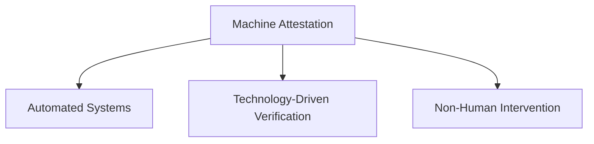
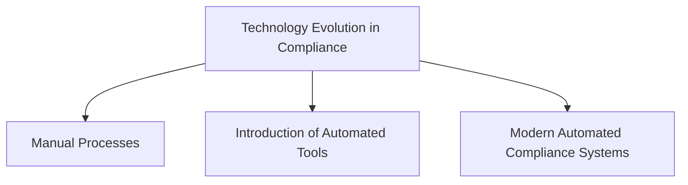
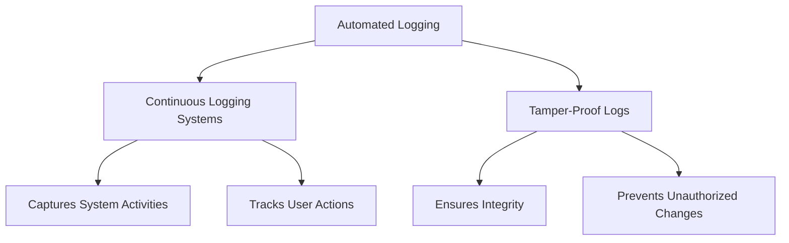
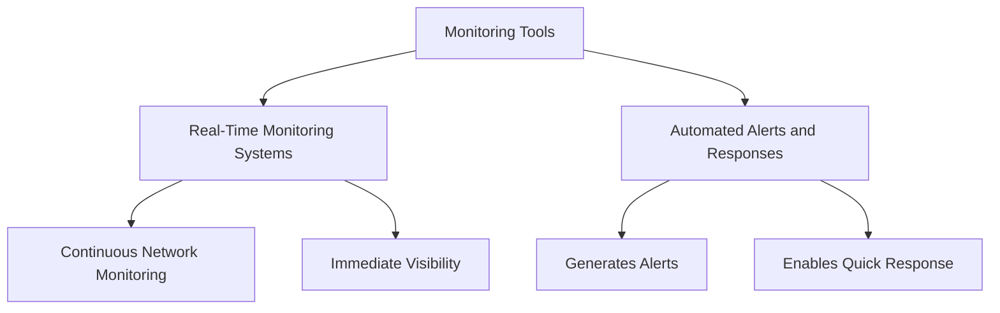
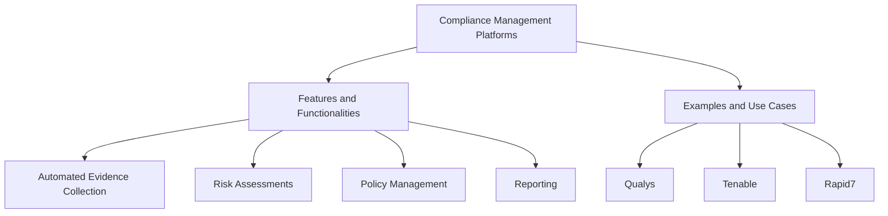
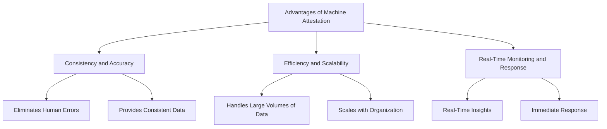
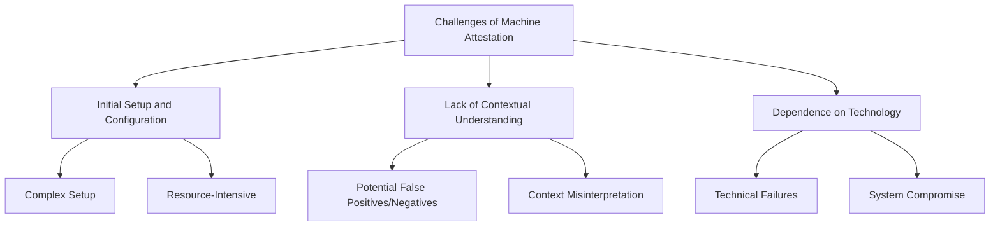
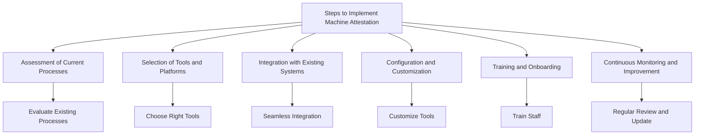
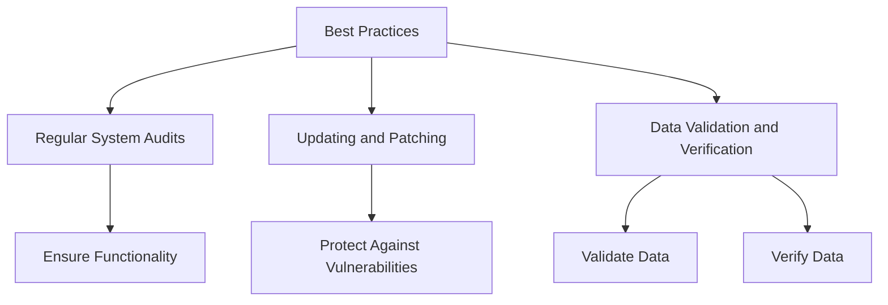
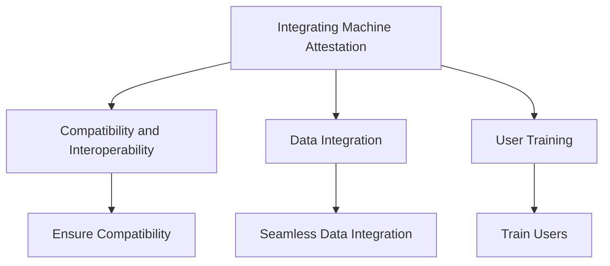

## Overview of Machine Attestation

### Definition and Explanation of Machine Attestation
Machine attestation involves using automated systems and technologies to verify and document compliance with regulatory and policy requirements. These systems generate, collect, and analyze compliance evidence without human intervention, ensuring a high degree of consistency and accuracy.

### Evolution of Technology in Compliance Attestation
Over the past few decades, the advancement of technology has transformed compliance processes. Initially, compliance relied heavily on manual processes and human judgment. However, with the advent of sophisticated software and tools, many aspects of compliance have been automated, leading to increased efficiency, accuracy, and scalability.

## Types of Machine Attestation

### Automated Logging
- **Continuous Logging Systems**: Automated logging systems continuously capture and store system activities. These logs are crucial for tracking user actions, detecting anomalies, and ensuring compliance with security policies.
- **Importance and Benefits of Tamper-Proof Logs**: Tamper-proof logs ensure the integrity and reliability of logged data, making it difficult for unauthorized individuals to alter or delete logs.

### Monitoring Tools
- **Real-Time Monitoring Systems**: These systems continuously monitor network traffic, system activities, and user actions in real time. They provide immediate visibility into potential compliance issues.
- **Role of Automated Alerts and Responses**: Automated monitoring tools generate alerts when potential compliance violations are detected, allowing for immediate investigation and response.

### Compliance Management Platforms
- **Features and Functionalities of Compliance Automation Tools**: These platforms offer a wide range of features, including automated evidence collection, risk assessments, policy management, and reporting. They streamline compliance processes and ensure that organizations stay up-to-date with regulatory requirements.
- **Examples of Platforms and Their Use Cases**: Some popular compliance management platforms include Qualys, Tenable, and Rapid7. These platforms are used across various industries to manage compliance efforts effectively.

## Advantages and Challenges of Machine Attestation

### Advantages
- **Consistency and Accuracy**: Automated systems eliminate human errors and provide consistent and accurate compliance evidence.
- **Efficiency and Scalability**: These systems can handle large volumes of data and scale easily as the organization grows.
- **Real-Time Monitoring and Response**: Machine attestation tools provide real-time insights and allow for immediate responses to compliance issues.

### Challenges
- **Initial Setup and Configuration**: Setting up and configuring automated systems can be complex and resource-intensive.
- **Lack of Contextual Understanding**: Automated systems may not understand the context of certain actions, leading to potential false positives or negatives.
- **Dependence on Technology and Potential for Technical Failures**: Over-reliance on automated systems can be risky if the systems fail or are compromised.

## Implementing Machine Attestation

### Steps to Implement Machine Attestation Systems
1. **Assessment of Current Compliance Processes**: Evaluate existing compliance processes to identify areas that can be automated.
2. **Selection of Appropriate Tools and Platforms**: Choose the right tools and platforms that fit the organization’s compliance needs.
3. **Integration with Existing Systems**: Ensure that the selected tools integrate seamlessly with current IT infrastructure.
4. **Configuration and Customization**: Configure and customize the tools to meet specific compliance requirements.
5. **Training and Onboarding**: Train staff on how to use the new systems effectively.
6. **Continuous Monitoring and Improvement**: Regularly review and update the systems to address new compliance challenges and improve performance.

### Best Practices for Ensuring Accuracy and Reliability
- **Regular System Audits**: Conduct regular audits of the automated systems to ensure they are functioning correctly.
- **Updating and Patching**: Keep the systems updated with the latest patches and updates to protect against vulnerabilities.
- **Data Validation and Verification**: Implement processes to validate and verify the data generated by automated systems.

### Integrating Machine Attestation with Existing Systems
- **Compatibility and Interoperability**: Ensure that the new automated systems are compatible with existing IT infrastructure.
- **Data Integration**: Seamlessly integrate data from different sources to provide a comprehensive view of compliance.
- **User Training**: Train users on how to interact with the new systems and understand the data they generate.

