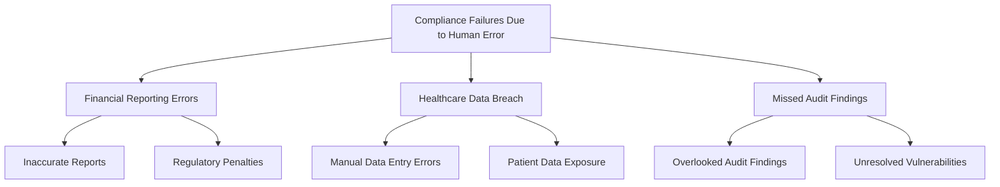
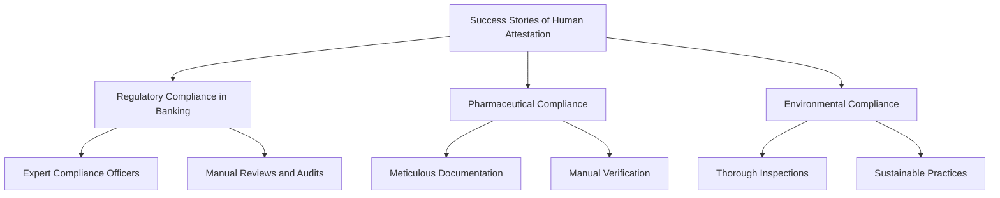
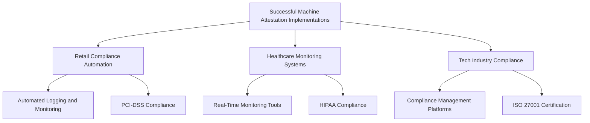
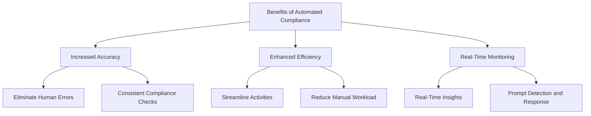
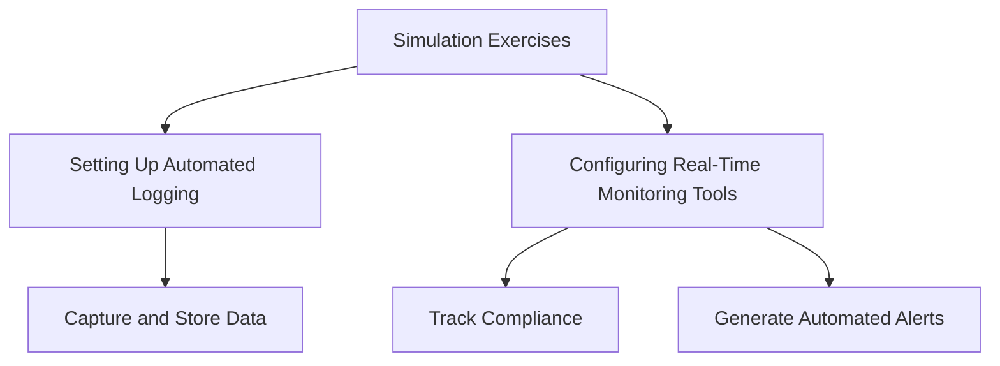
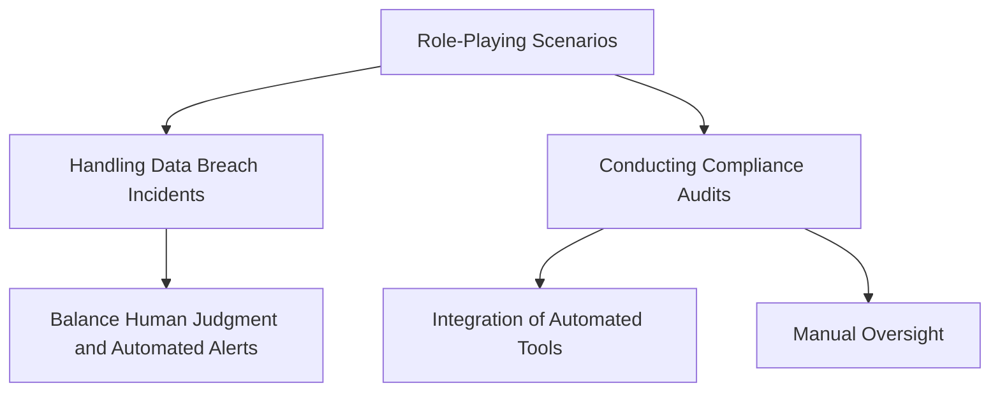
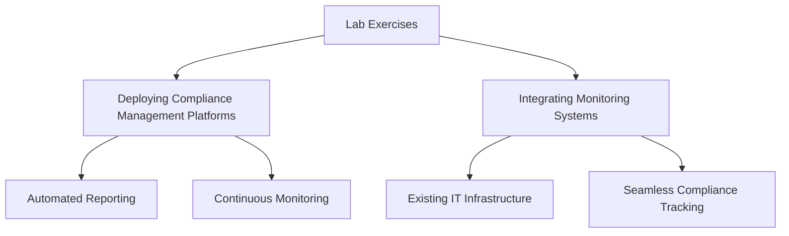

## Case Studies in Human Attestation

### Examples of Compliance Failures Due to Human Error
Human error is a significant factor in many compliance failures. These case studies illustrate how mistakes in human attestation can lead to compliance breaches and the resulting consequences.

- **Financial Reporting Errors**: A financial institution experienced a compliance failure due to inaccuracies in manually prepared financial reports. The oversight led to regulatory penalties and damaged the institution’s reputation.
- **Healthcare Data Breach**: A healthcare provider failed to comply with HIPAA regulations because of errors in manual data entry and access control checks. This breach resulted in patient data exposure and substantial fines.
- **Missed Audit Findings**: An organization overlooked critical audit findings due to human error in the review process. This oversight led to unresolved vulnerabilities and eventual security breaches.

### Success Stories of Human Attestation in Complex Compliance Environments
Despite its challenges, human attestation can be highly effective in complex compliance environments where human judgment and expertise are crucial.

- **Regulatory Compliance in Banking**: A bank successfully navigated complex regulatory requirements by leveraging the expertise of its compliance officers. Manual reviews and audits ensured compliance with evolving regulations.
- **Pharmaceutical Compliance**: A pharmaceutical company maintained compliance with FDA regulations through meticulous documentation and manual verification processes, ensuring the safety and efficacy of its products.
- **Environmental Compliance**: An energy company achieved compliance with environmental regulations by conducting thorough manual inspections and audits, demonstrating its commitment to sustainable practices.

## Case Studies in Machine Attestation

### Examples of Successful Machine Attestation Implementations
Machine attestation has proven successful in various industries, enhancing compliance through automation. These case studies highlight the benefits realized from implementing automated compliance processes.

- **Retail Compliance Automation**: A large retail chain implemented automated logging and monitoring tools to comply with PCI-DSS. The automation reduced manual workload, improved accuracy, and expedited compliance audits.
- **Healthcare Monitoring Systems**: A hospital adopted real-time monitoring tools for HIPAA compliance, which enhanced data security and ensured continuous compliance with patient privacy regulations.
- **Tech Industry Compliance**: A tech company utilized compliance management platforms to achieve ISO 27001 certification. The platform streamlined compliance tasks, generated automated reports, and facilitated continuous monitoring.

### Benefits Realized from Automated Compliance Processes
Automation in compliance offers numerous benefits, including increased accuracy, efficiency, and real-time monitoring. These benefits are evident in successful machine attestation implementations.

- **Increased Accuracy**: Automated systems eliminate human errors, ensuring precise and consistent compliance checks.
- **Enhanced Efficiency**: Automation streamlines compliance activities, reducing manual workload and speeding up processes.
- **Real-Time Monitoring**: Continuous monitoring tools provide real-time insights into compliance status, allowing for prompt detection and response to issues.

## Hands-On Exercises and Simulations

### Simulation Exercises for Implementing Machine Attestation
Simulation exercises provide practical experience in implementing machine attestation systems. These exercises help participants understand the setup and configuration of automated compliance tools.

- **Setting Up Automated Logging**: Participants will configure continuous logging systems to capture and store compliance-related data.
- **Configuring Real-Time Monitoring Tools**: Exercises will involve setting up monitoring tools to track compliance in real-time and generate automated alerts.

### Role-Playing Scenarios to Practice Responding to Compliance Challenges
Role-playing scenarios help participants practice responding to compliance challenges using both human and machine attestation methods.

- **Handling Data Breach Incidents**: Participants will role-play responses to data breach incidents, balancing human judgment and automated alerts.
- **Conducting Compliance Audits**: Scenarios will involve conducting compliance audits, demonstrating the integration of automated tools with manual oversight.

### Lab Exercises for Configuring and Deploying Automated Compliance Tools
Lab exercises offer hands-on experience in configuring and deploying automated compliance tools, providing practical skills for implementing machine attestation.

- **Deploying Compliance Management Platforms**: Participants will deploy and configure compliance management platforms, focusing on features like automated reporting and continuous monitoring.
- **Integrating Monitoring Systems with Existing Infrastructure**: Exercises will involve integrating real-time monitoring systems with existing IT infrastructure to ensure seamless compliance tracking.

