## Why Transition to Machine Attestation

### Benefits of Automation in Compliance
Automation in compliance offers numerous benefits, including enhanced accuracy, consistency, and efficiency. Automated systems can handle large volumes of data quickly and accurately, reducing the risk of human error and ensuring that compliance processes are consistently applied.

- **Enhanced Accuracy**: Automated systems eliminate human errors and ensure precise compliance checks.
- **Consistency**: Automated processes ensure that compliance procedures are uniformly applied across the organization.
- **Efficiency**: Automation speeds up compliance activities, freeing up human resources for more strategic tasks.

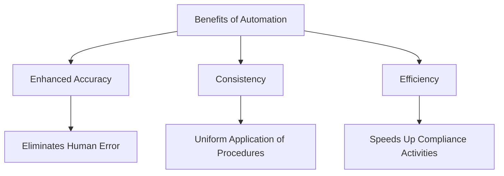

### Case Studies Showcasing Successful Transitions
Several organizations have successfully transitioned from human to machine attestation, showcasing the transformative impact of automation on compliance processes.

- **Financial Institution**: Implemented automated logging and monitoring tools to comply with PCI-DSS, resulting in faster audits and reduced manual effort.
- **Healthcare Provider**: Adopted compliance management platforms for HIPAA compliance, improving data security and reducing the risk of breaches.
- **Tech Company**: Leveraged automated compliance tools to achieve ISO 27001 certification, enhancing their security posture and customer trust.

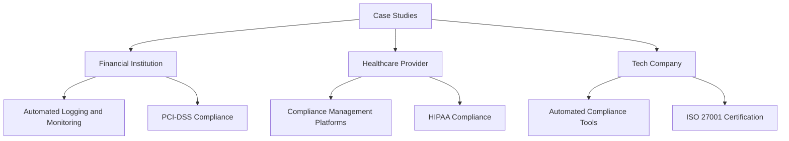

## Challenges and Considerations in Transition

### Common Challenges Organizations Face
Transitioning from human to machine attestation can present several challenges, including resistance to change, integration issues, and initial setup complexities.

- **Resistance to Change**: Employees may resist transitioning to automated systems due to fear of job loss or discomfort with new technologies.
- **Integration Issues**: Integrating new automated systems with existing IT infrastructure can be complex and resource-intensive.
- **Initial Setup Complexities**: Setting up and configuring automated compliance tools require significant time and effort.

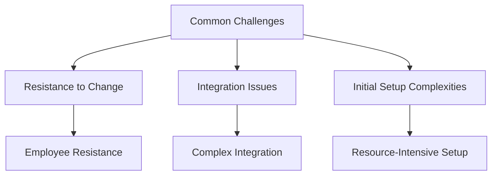

### Mitigating Risks and Ensuring a Smooth Transition
To ensure a smooth transition, organizations should develop a comprehensive transition plan, addressing potential risks and challenges proactively.

- **Developing a Transition Plan**: Outline clear steps and timelines for the transition process.
- **Engaging Stakeholders**: Involve key stakeholders to gain their buy-in and support.
- **Conducting Pilot Programs**: Test automated systems on a small scale before full implementation to identify and address issues early.

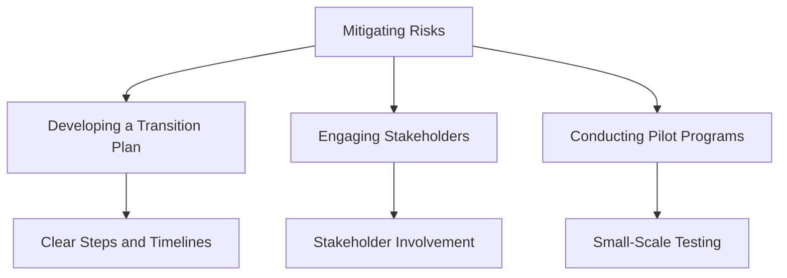

### Training and Change Management for Staff
Training and change management are critical components of a successful transition. Ensuring that staff are well-prepared and supported can help mitigate resistance and ensure the effective adoption of new systems.

- **Training Programs**: Develop comprehensive training programs to educate staff on new automated systems and their benefits.
- **Change Management Strategies**: Implement change management strategies to address resistance and facilitate smooth adoption.
- **Ongoing Support**: Provide ongoing support and resources to help staff adapt to new systems and processes.

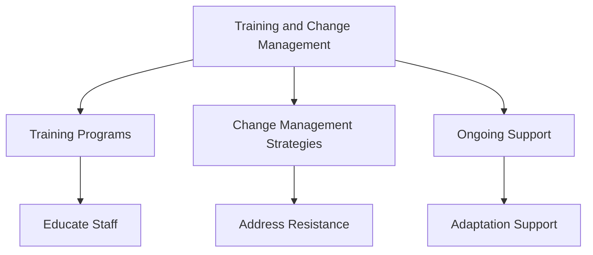

## Strategies for Effective Transition

### Assessing Current Compliance Processes
Begin by thoroughly assessing current compliance processes to identify areas that can benefit from automation.

- **Process Mapping**: Map out existing compliance processes to gain a clear understanding of current workflows.
- **Identifying Pain Points**: Identify pain points and inefficiencies in current processes that automation can address.
- **Evaluating Compliance Requirements**: Evaluate compliance requirements to determine which aspects can be automated.

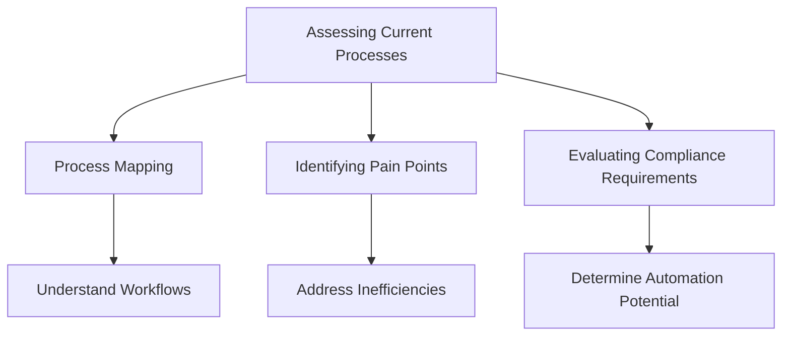

### Identifying Areas Suitable for Automation
Not all compliance processes may be suitable for automation. Focus on areas where automation can have the most significant impact.

- **High-Volume Tasks**: Identify tasks that are repetitive and high-volume, which can benefit from automation.
- **Data-Intensive Processes**: Target processes that involve large amounts of data and require accuracy and consistency.
- **Manual and Time-Consuming Activities**: Automate activities that are currently manual and time-consuming to improve efficiency.

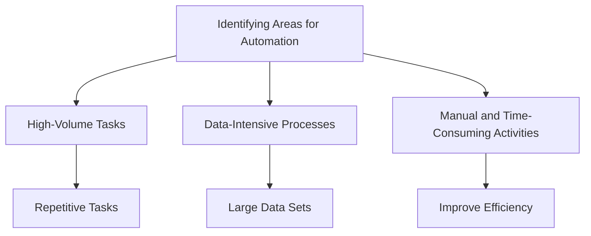

### Developing a Phased Implementation Plan
Implementing machine attestation should be done in phases to manage risks and ensure a smooth transition.

- **Pilot Phase**: Start with a pilot phase to test automated systems on a small scale.
- **Gradual Rollout**: Gradually expand the implementation, addressing any issues that arise.
- **Full Implementation**: Move to full implementation once the automated systems are proven effective and stable.

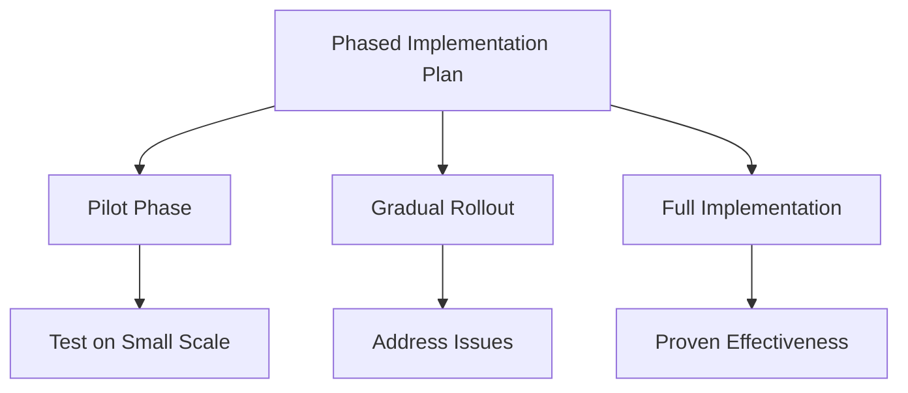

### Continuous Monitoring and Improvement
Continuous monitoring and improvement are essential to ensure the long-term success of machine attestation systems.

- **Regular Audits**: Conduct regular audits to ensure automated systems are functioning correctly.
- **Feedback Loops**: Establish feedback loops to gather input from users and stakeholders.
- **System Updates**: Regularly update and improve automated systems to address new compliance requirements and technological advancements.

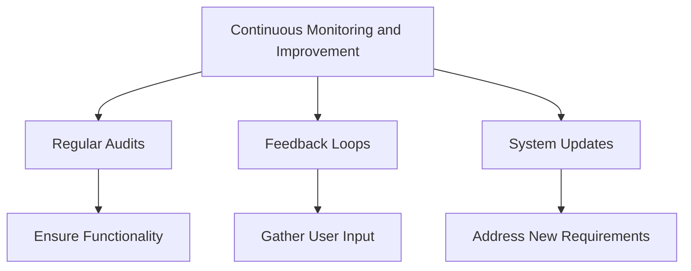

## Balancing Human and Machine Attestation

### Scenarios Where Human Attestation is Still Necessary
Despite the benefits of machine attestation, there are scenarios where human judgment and expertise are still required.

- **Complex Situations**: Situations that require nuanced understanding and contextual analysis.
- **Legal and Ethical Considerations**: Scenarios involving legal or ethical considerations where human oversight is essential.
- **Exception Handling**: Handling exceptions and anomalies that automated systems may not be equipped to address.

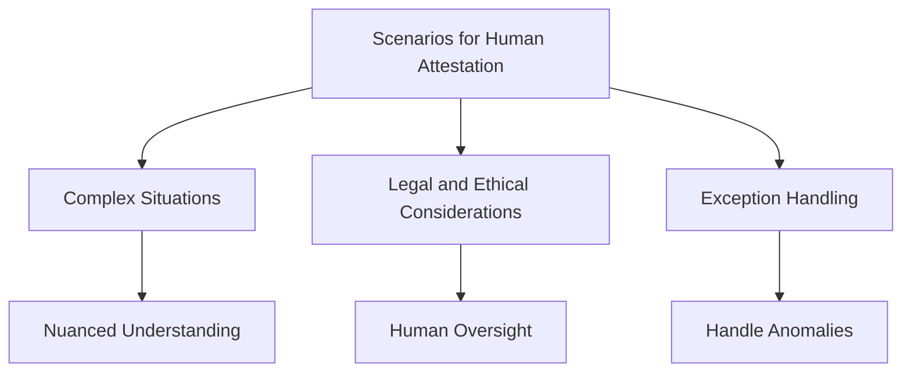

### Hybrid Approaches Combining Human Judgment with Machine Efficiency
Adopting a hybrid approach can leverage the strengths of both human and machine attestation.

- **Automated Systems with Human Oversight**: Use automated systems for routine tasks while maintaining human oversight for critical decision-making.
- **Collaborative Decision-Making**: Foster collaboration between automated systems and human experts to enhance decision-making processes.
- **Dynamic Allocation of Tasks**: Allocate tasks dynamically based on complexity, with simpler tasks handled by automated systems and complex ones by humans.

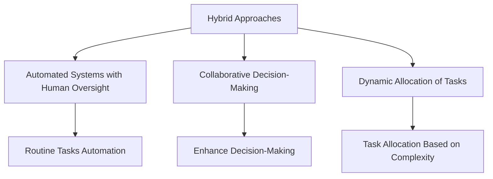

### Ensuring Oversight and Governance in Automated Processes
Maintaining oversight and governance is crucial to ensure that automated processes remain effective and compliant.

- **Governance Frameworks**: Establish governance frameworks to oversee automated compliance processes.
- **Regular Reviews**: Conduct regular reviews of automated systems to ensure they adhere to compliance requirements.
- **Accountability Mechanisms**: Implement mechanisms to ensure accountability in automated processes, such as audit trails and logging.

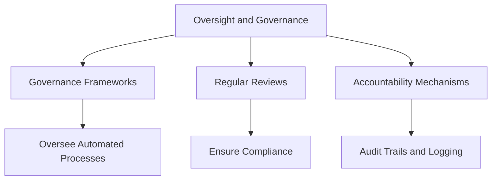
