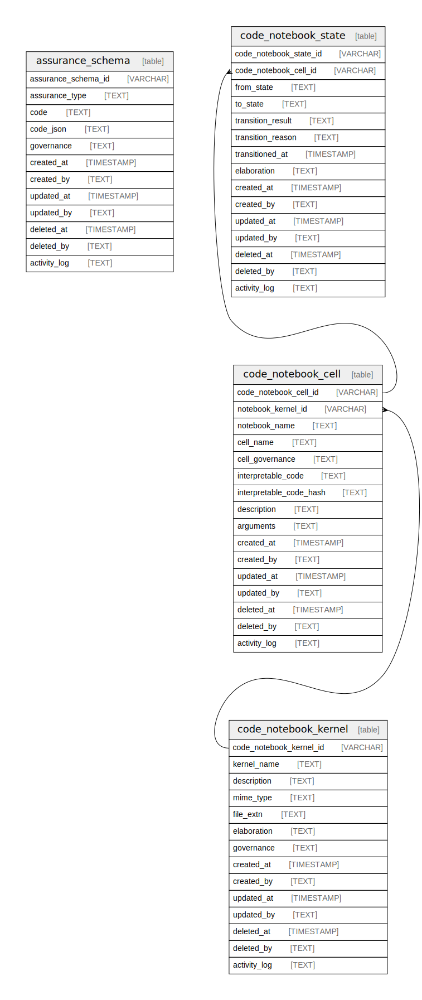

## Tables

| Name                                            | Columns | Comment                                                                                                                                                                                                                                                                                                                                                                                                   | Type  |
| ----------------------------------------------- | ------- | --------------------------------------------------------------------------------------------------------------------------------------------------------------------------------------------------------------------------------------------------------------------------------------------------------------------------------------------------------------------------------------------------------- | ----- |
| [assurance_schema](/surveilr/reference/db/surveilr-code-notebooks-schema/assurance_schema)         | 12      | A Notebook is a group of Cells. A kernel is a computational engine that executes the code contained in a notebook cell.  Each notebook is associated with a kernel of a specific programming language or code transformer which can interpret  code and produce a result. For example, a SQL notebook might use a SQLite kernel for running SQL code and an AI Prompt  might prepare AI prompts for LLMs. | table |
| [code_notebook_kernel](/surveilr/reference/db/surveilr-code-notebooks-schema/code_notebook_kernel) | 14      | A Notebook is a group of Cells. A kernel is a computational engine that executes the code contained in a notebook cell.  Each notebook is associated with a kernel of a specific programming language or code transformer which can interpret  code and produce a result. For example, a SQL notebook might use a SQLite kernel for running SQL code and an AI Prompt  might prepare AI prompts for LLMs. | table |
| [code_notebook_cell](/surveilr/reference/db/surveilr-code-notebooks-schema/code_notebook_cell)     | 16      | Each Notebook is divided into cells, which are individual units of interpretable code.  The content of Cells depends on the Notebook Kernel and contain the source code to be  executed by the Notebook's Kernel. The output of the code (text, graphics, etc.) can be  stateless or may be stateful and store its results and state transitions in code_notebook_state.                                  | table |
| [code_notebook_state](/surveilr/reference/db/surveilr-code-notebooks-schema/code_notebook_state)   | 15      | Records the state of a notebook's cells' executions, computations, and results for Kernels that are stateful.  For example, a SQL Notebook Cell that creates tables should only be run once (meaning it's statefule).  Other Kernels might store results for functions and output defined in one cell can be used in later cells.                                                                         | table |

## Relations

